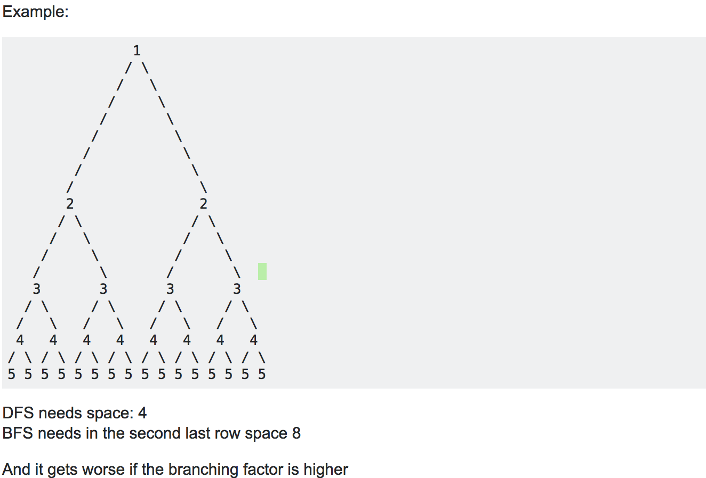

# Basic Graphs

## DFS

Uses a stack, visit the graph nodes by going as deep as possible first.

Time complexity is O(v + e) as we need to visit all nodes and in the worst case iterate through all edges (although might not visit the destination of that edge).

Space complexity is O(v) as we need v extra space for the stack and the output. Dfs will only store as much memory as needed for the longest possible path in the graph, this makes it more memory efficient than bfs.

Worst case space complexity need O(v) nodes on the recursive stack for a linear chain as the graph.

```python
def dfs(graph, node, visited, output):
    visited[node.index] = 1
    output.append(node)
    for edge in graph.get_adjacent_edges(node):  # Visit node depth first (go as far as possible) if not already visited.
        if visited[edge.destination.index] != 1:
            dfs(graph, edge.destination, visited, output)
```

## BFS

Uses a queue, visit the graph nodes by expanding the frontier (reachable nodes) by 1 each time, can use to find shortest path.

Time complexity is O(v + e) as we need to visit all nodes and in the worst case iterate through all edges (although might not visit the destination of that edge).

Space complexity is O(v) as we need v extra space for the queue and the output, it uses more memory as the queue can become very big but dfs uses the recursive stack.

Worst case space complexity need O(v) nodes in the queue for a high branching factor at the root.

```python
def bfs(graph, root):
    q = deque([root])
    visited = [0] * len(graph.get_all_vertices())
    output = []
    while q:
        node = q.popleft()
        if visited[node.index] == 0:
            visited[node.index] = 1
            output.append(node)
        for edge in graph.get_adjacent_edges(node):
            next_node = edge.destination
            if visited[next_node.index] == 0:
                q.append(next_node)
    return output
```

## BFS vs DFS

In both worst case == best case as you need to traverse the entire structure.

Dfs uses the computer recursion stack so is generally faster than in memory of your program.

Bfs will queue every node at a fixed depth. If for example you have 1 root node connected to 1000 nodes bfs will enqueue all them while dfs will just recurse once for each edge meaning it will need memory for 1 next node while bfs stores 1000.

Bfs uses more memory when the branching factor is higher.



> Wanna find the (strongly/)connected components of the graph? or solve the maze or sudoku? Use DFS. If you look closely, the Pre-Order, Post-Order and In-Order are all variants of the DFS. So, yes, that's some interesting applications.
> BFS if you want to test if a graph is bipartite, find the shortest path between two nodes or applications that require such tasks.

## Dijkstra
`O(v * log e)`
> Dijkstra's original variant found the shortest path between two nodes,[2] but a more common variant fixes a single node as the "source" node and finds shortest paths from the source to all other nodes in the graph, producing a shortest-path tree.

```python
import heapq
import math

def relax(source, destination, edge, distances):
    if distances[source.index] + edge.cost < distances[destination.index]:
        distances[destination.index] = distances[source.index] + edge.cost
        # destination.distance = distances[destination.index]
        return True
    return False

def dijkstra(graph, source):
    pq = []
    nodes = graph.get_all_vertices()
    distances = [math.inf] * len(nodes)
    path = [-1] * len(nodes)
    distances[source.index] = 0
    for node in nodes:
        # Store as (priority, task) tuples, heapq will sort on first element.
        heapq.heappush(pq, (distances[node.index], node))
    while pq:
        # Assumes non negative weights, so when popping a node it is the best way to get there.
        dist, node = heapq.heappop(pq)
        for edge in graph.get_adjacent_edges(node):
            # Note: can't terminate early and do this.
            # if distances[edge.destination.index] != math.inf:  # We already have the shortest path to this node.
            #     continue
            if relax(node, edge.destination, edge, distances):
                # Found a better way to get to a next node, add that to the pq and set the parent.
                heapq.heappush(pq, (distances[edge.destination.index], edge.destination))
                path[edge.destination.index] = node.index
    return distances, path  # Shortest path from source to any other node in distances.
```

Note: You can not terminate early in dijkstra if you think you have already visited a particular node.
This is because you may have added the node with an edge into your pq before exploring an alternate path with a cheaper cost eg:

If you have the following graph:
```
(s) -- 3 --> (c) -- 12 --> (d)
 \                         ^
  --------------- 20 -----/
```

You will start by adding (s) to your pq, then you will explore edges from (s) resulting in you adding (c) and (d).
If we mark (d) as visited don't process it ever again then the shorter path from (s) to (d) through (c) will not be found.

The time complexity for dijkstra is:

Analysis 1:
[stack overflow, makes a lot of sense](https://stackoverflow.com/questions/18604803/why-is-the-complexity-of-bfs-ove-instead-of-ove)
1. For each node we will visit all edges O(v - 1)
2. Each node v can be connected to at max n - 1 other nodes. So at max v - 1
3. For a single vertex, we visit edges and might need to update the value and push it on to our min heap v - 1 times as any vertex will have at max e incoming edges. Pushing it on to the pq will be at worst log v as there are v nodes O(v - 1 * log v).
4. Applying 3 to all vertexes then we get O(v  * (v - 1 * log v)) = O(v * (v - 1) * log v)
5. Note that the maximum number of edges in a graph of v nodes is v * (v - 1) as each node can go to every other node except itself. Applying e = v * (v - 1) we get O(e * log v)

Analysis 2:
[geeks for geeks](http://www.geeksforgeeks.org/greedy-algorithms-set-7-dijkstras-algorithm-for-adjacency-list-representation/)
1. Graph traversal is at most O(v + e) like in bfs/dfs as we will visit all nodes and all edges (although we might revisit a node in dijkstra it will have the same upper bound).
2. At each step in our traversal we might add something on to our pq which would take O(log v) time.
3. So it is O(v + e) * O (log v) = O(v * log v + e * log v), as e is at max v * (v - 1) it is dominated by O( e * log v)


## Bellman-Ford
- `O(V * E)`
- single-source shortest paths
- handles negative weights

Given a graph `G = (V, E)` `bellman-ford()` returns a `False` if there is a negative-weight cycle reachable from the source else `True`.
If there is no such cycle then the algorithm will produce the shortest path.

Progressively decrease estimate distance on the weight of a shortest path until actual weight reached
Relax all edges

This translates to:
```
Do for the number of vertexes:
    relax all edges in any order
```

```python
def relax(edge, parents, distance):
    origin = edge.origin
    destination = edge.destination
    cost = edge.weight

    if distance[origin.index] + cost < distance[destination.index]:
        distance[destination.index] = distance[origin.index] + cost
        parents[destination.index] = origin.index

def bellman_ford(graph, source, parents, distance):  # O(V * E)
    distance[source.index] = 0
    # Does work here.
    for node in graph.get_vertices():  # O(V) Can improve this by stopping if nothing changes.
        for edge in graph.get_all_edges():  # O(E)
            relax(edge, parents, distance)
    # One more check to see if there are negative cycles.
    for edge in graph.get_all_edges():
        if distance[edge.destination.index] > distance[edge.origin.index] + edge.weight:
            return False
    return True
```

Note: This is shortest path from a single source (gets it to every other node). We can run `bellman-ford` `O(V)` times which will be `O(V^2 * E)`, but `E` can go up to `O(V^2)` resulting in `O(V^4)`.
`Floyd-Warshall` can do this in `O(V^3)`

Note: Each iteration of bellman-ford will decrease distance when there is a negative cycle.

## Floyd-Warshall

All pairs shortest paths, gives the shortest path between any two pairs.

O(v^3)

```python
def floyd_warshall(graph):  # O(V^3)
    nodes = graph.get_all_vertices()
    num_nodes = len(nodes)
    # Stores shortest path, distances[i][j] is the shortest path from node i to node j.
    # If no path will be inf.
    distances = [[math.inf for _ in range(num_nodes)] for _ in range(num_nodes) ]
    path = [[-1 for _ in range(num_nodes)] for _ in range(num_nodes) ]

    for node in nodes:
        distances[node.index][node.index] = 0  # A node to itself is 0.

    for edge in graph.get_all_edges():  # graph is directed.
        # You can get from origin to destination of an edge with cost the weight of the edge.
        distances[edge.origin.index][edge.destination.index] = edge.weight
        path[edge.origin.index][edge.destination.index] = edge.origin.index

    for k in range(num_nodes):
        # Is going through node k going to give a shorter distance.
        for i in range(num_nodes):
            # Look at node i.
            for j in range(num_nodes):
                # Try get to node j.
                if distances[i][j] > distances[i][k] + distances[k][j]:
                    # Cost to get to node j from i is greater than the cost to get from i to k and then from k to j.
                    # Meaning we found a shorter path going through node k.
                    distances[i][j] = distances[i][k] + distances[k][j]
                    path[i][j] = path[k][j]  # Update path to show shortest path from i to j goes through k to get to j.

    # Check if there is a negative weight cycle, if a diagonal is negative there is a negative weight cycle.
    for i in range(num_nodes):
        if distances[i][i] < 0:
            print("Has negative weight cycle")
            return False, path

    return distances, path
```

# Comparisons

# Components

## Topological Sort

Assumes a dag so the graph can not contain a cycle.

Start from any node, explore it's children, once all children have been added to the set we add it the parent node to the stack.

Exploring children first and putting them on the stack first means when we pop elements off it is guaranteed parents
happen before children meaning we can only do child after parent so we get a valid topological ordering.

```python
def topological_sort_rec(dag, node, visited, stack):  # Called O(n) times at max.
    print('called')  # Can use this to show it has only been called O(n) times.
    if visited[node.index] != 1:
        visited[node.index] = 1
        for edge in dag.get_adjacent_edges(node):  # Explore all children, O(e).
            if visited[edge.destination.index] == 0:
                topological_sort_rec(dag, edge.destination, visited, stack)
        stack.append(node)  # Add node to the stack only once all children explored.

def topological_sort_aux(dag):
    nodes = dag.get_all_vertices()
    visited = [0] * len(nodes)
    stack = deque()

    for node in nodes: # O(n)
        if visited[node.index] == 0:
            topological_sort_rec(dag, node, visited, stack)
    topological_ordering = []
    while stack: # O(n)
        topological_ordering.append(stack.pop().rep)
    return topological_ordering
```

The upper recursive function is called at max O(n) times where n is the number of nodes as we only want to visit each once.
For each node we visit all it's children (bounded by O(e)) and then once it has no more children we add it to the stack.
It is another O(n) to get the values out of the stack.
As we only explore each child once (go down an edge once) and we explore each node it is O(v + e).

Can be seen as a DFS with an extra stack so O(v + e).

## Connected Components

A connected component is any two nodes connected to each other by a path.


## Tarjan's Strongly Connected Components

Assumes graph is a direct graph.

Partitions the nodes in the graph into strongly connected components where each node only appears once.

A vertex not on a directed cycle forms a strongly connected component with itself.

Key idea:
1. pick any start node arbitrary.
2. visit children

## Articulation points (cut vertices)

An articulation point is a vertex that if removed (and the edges though it) will disconnect the graph.


