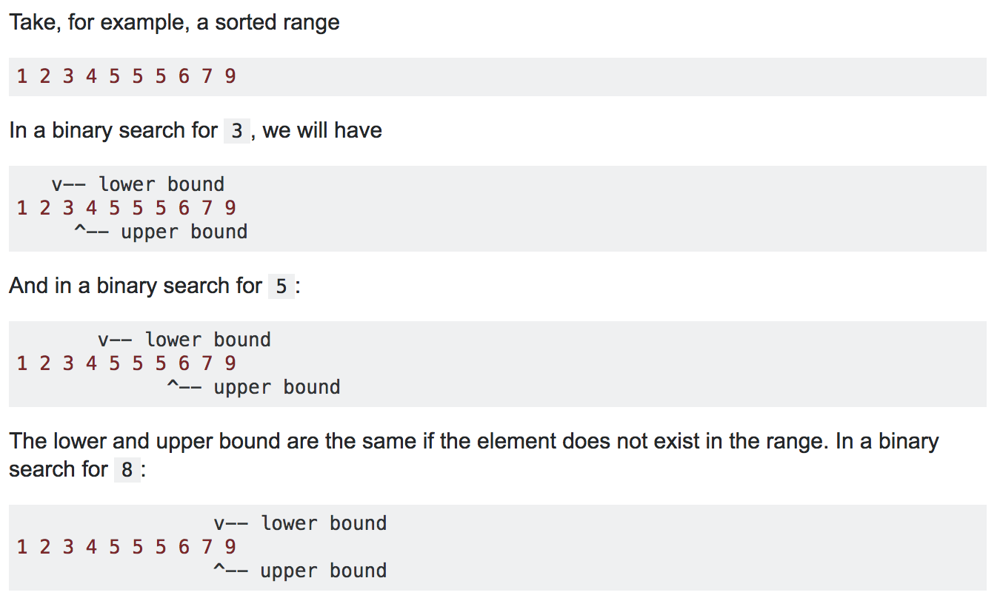

# Binary Search


## Basic binary search

The basic binary search algorithm discards half the problem set each time.

We get the middle element of a sorted input by dividing the sum of the bounds by 2 e.g. `mid = (hi + lo)/2`

Then check is our target against the middle element (middle_element = array[mid]) resulting in the 3 cases:
- target == middle_element, return the index of the middle element
- target > middle_element, discard the bottom half of the input as the target can't be in it so set `lo = mid + 1`
- target < middle_element, discard the top half of the input as the target can't be in it so set `hi = mid - 1`

We can do `mid - 1` and `mid + 1` because if target is > middle_element are have already checked the index `mid` so when we discard the bottom half
we don't need to make it inclusive of `mid`.

In general I think the check in the while loop should be `lo <= hi` as if `lo` and `hi` are the same then mid is just `array[lo]` making sure we don't miss checking
sub arrays of length 1. Additionally if we do `mid - 1` and `mid + 1` then if the item is not found we will eventually get to `lo  > hi` terminating the loop.

```python
def binary_search(array, target):
    lo = 0
    hi = len(array) - 1
    while lo <= hi:
        mid = (lo + hi) // 2
        if array[mid] == target:
            return mid
        elif array[mid] > target:  # Discard top half.
            hi = mid - 1
        else:  # Discard bottom half.
            lo = mid + 1
    return -1  # Not found.
```

Worst & average case time complexity is O(log n) as we are discarding half the problem set at each iteration [reasoning for O(log n) when discarding half the problem](../../concepts/big_o.md)
Best case time complexity is O(1) when the first item check in the middle is thr target.

Space complexity is O(1) as no extra space is needed since we use the same array inplace.

## Root finding

Binary search can be modified to find the nth root of a number.

Key idea:
1. set max and min bounds for the number, min=0 and max=10000000 (something big) is a good idea.
2. start at the middle or (min + max) / 2 resulting in a float
3. check if middle^n when rounded to the expected accuracy is equal to the number where n is the nth root.
4. apply binary search to move min and max bounds
5. repeat

Note: doing this recursively in python may mean max recursion stack limit.

```python
number = 17
min_v = 0
max_v = 100000000
accuracy = 6
nth_dimension_root = 3

def binary_search_nth_root(number, nth_root, min_val, max_val, accuracy):
    hi = max_val
    lo = min_val
    while lo < hi:
        mid_val = (hi + lo) / 2  # Current estimate of the nth root.
        approx = round(mid_val ** nth_root, accuracy)
        print("approx: %s" % approx)
        if approx == number:  # Note: Round can round floats to accuracy decimal points.
            return mid_val
        elif approx > number:
            hi = mid_val
        else:
            lo = mid_val
    return -1
```

This works as effecttivley we are trying all possible real numbers to see if they come close enough to the nth root.
In the above example when printing out the approximations we get something like this:
```
approx: 1.25e+23, mid_val: 50000000.0, hi: 100000000, lo: 0
approx: 1.5625e+22, mid_val: 25000000.0, hi: 50000000.0, lo: 0
approx: 1.953125e+21, mid_val: 12500000.0, hi: 25000000.0, lo: 0
approx: 2.44140625e+20, mid_val: 6250000.0, hi: 12500000.0, lo: 0
...
approx: 1694.065895, mid_val: 11.920928955078125, hi: 23.84185791015625, lo: 0
approx: 211.758237, mid_val: 5.9604644775390625, hi: 11.920928955078125, lo: 0
approx: 26.46978, mid_val: 2.9802322387695312, hi: 5.9604644775390625, lo: 0
approx: 3.308722, mid_val: 1.4901161193847656, hi: 2.9802322387695312, lo: 0
approx: 11.166938, mid_val: 2.2351741790771484, hi: 2.9802322387695312, lo: 1.4901161193847656
approx: 17.732684, mid_val: 2.60770320892334, hi: 2.9802322387695312, lo: 2.2351741790771484
approx: 14.19778, mid_val: 2.421438694000244, hi: 2.60770320892334, lo: 2.2351741790771484
approx: 15.899801, mid_val: 2.514570951461792, hi: 2.60770320892334, lo: 2.421438694000244
approx: 16.799582, mid_val: 2.561137080192566, hi: 2.60770320892334, lo: 2.514570951461792
approx: 17.26193, mid_val: 2.584420144557953, hi: 2.60770320892334, lo: 2.561137080192566
approx: 17.02971, mid_val: 2.5727786123752594, hi: 2.584420144557953, lo: 2.561137080192566
approx: 16.914385, mid_val: 2.5669578462839127, hi: 2.5727786123752594, lo: 2.561137080192566
approx: 16.971982, mid_val: 2.569868229329586, hi: 2.5727786123752594, lo: 2.5669578462839127
approx: 17.00083, mid_val: 2.5713234208524227, hi: 2.5727786123752594, lo: 2.569868229329586
approx: 16.986402, mid_val: 2.5705958250910044, hi: 2.5713234208524227, lo: 2.569868229329586
approx: 16.993615, mid_val: 2.5709596229717135, hi: 2.5713234208524227, lo: 2.5705958250910044
approx: 16.997222, mid_val: 2.571141521912068, hi: 2.5713234208524227, lo: 2.5709596229717135
approx: 16.999026, mid_val: 2.5712324713822454, hi: 2.5713234208524227, lo: 2.571141521912068
approx: 16.999928, mid_val: 2.571277946117334, hi: 2.5713234208524227, lo: 2.5712324713822454
approx: 17.000379, mid_val: 2.5713006834848784, hi: 2.5713234208524227, lo: 2.571277946117334
approx: 17.000153, mid_val: 2.5712893148011062, hi: 2.5713006834848784, lo: 2.571277946117334
approx: 17.00004, mid_val: 2.57128363045922, hi: 2.5712893148011062, lo: 2.571277946117334
approx: 16.999984, mid_val: 2.571280788288277, hi: 2.57128363045922, lo: 2.571277946117334
approx: 17.000012, mid_val: 2.5712822093737486, hi: 2.57128363045922, lo: 2.571280788288277
approx: 16.999998, mid_val: 2.571281498831013, hi: 2.5712822093737486, lo: 2.571280788288277
approx: 17.000005, mid_val: 2.5712818541023807, hi: 2.5712822093737486, lo: 2.571281498831013
approx: 17.000002, mid_val: 2.571281676466697, hi: 2.5712818541023807, lo: 2.571281498831013
approx: 17.0, mid_val: 2.571281587648855, hi: 2.571281676466697, lo: 2.571281498831013
2.571281587648855
```

Observe how we start at a really large number and each time the number decreases by a lot.
Initially it is halved in the first few iterations when `lo=0` then from 1694 to 211 to 26 etc as we creep closer to 17.
Then when we get to the first number lower than 17 we iterate around 17 += a bit to find as close an approximation as possible for the given accuracy.

We can see how `mid_val` gets refined from the bounds of `lo` and `hi` based on the approximation of `mid_val ** nth_root`

## Closest

This variation of binary search returns the index of the target if the target is in the array. Else it returns the index of the closest element.

Closest is defined as smallest absolute value when the target is subtracted.

It is exactly the same as the basic binary search above with ending with these lines instead of `return -1`.
```python
def binary_search_closest(array, target, verbose=False):
    ...
    # After exiting the while loop, getting to here means not found, evaluate closest to the one with the least difference.
    if hi < 0:
        hi = 0
    if lo > len(array) - 1:
        lo = len(array) - 1
    lo_diff = abs(array[lo] - target)
    hi_diff = abs(array[hi] - target)
    if verbose:
        print("target %s not in array" % target)
        print("lo: %s, lo_diff: %s" % (lo, lo_diff))
        print("hi: %s, hi_diff: %s" % (hi, hi_diff))
    return lo if lo_diff < hi_diff else hi
```

When binary search terminates lo is > hi. So we know they are not pointing to the same indexes.

For example with `array = [-10, -4, 0, 1, 2, 4, 5, 6, 8, 10]` calling `binary_search_closest(array, 7)` will return `7`.
The while loop will terminate when searching between the values 6 and 8 which are at index 7 and 8 respectively.
Upon termination `lo = 8` and `hi = 7`, so we can just check which value `array[lo]` or `array[hi]` has the smaller absolute difference to `target=7`.
So the output will be index `7` which has a difference of 1 from our target `array[7] = 6`.

In this approach we do need to check for bounds to make sure we don't access outside our array. If the target is < everything in the array
then the `lo=0` and `hi=0` and we return the smallest element in the array, likewise if it is > everything in the array `lo=len(array)-1` and `hi=len(array)-1`.

## Upper and Lower bound binary search

These variations of binary search returns the lowest position and highest position where the target can be inserted into the array without breaking ordering.



When we insert into index i we push everything from i to n to the right by 1 index and add the new element to index i.

### Lower Bound

Key idea:
Same as normal binary search but when
- an element is not found, return current place in the search instead of -1
- an element is found, search to the left until you find the first non matching element

```python
def lower_bound_binary_search(array, target):
    hi = len(array) - 1
    lo = 0
    while lo <= hi:
        mid = (hi + lo) // 2
        if array[mid] == target:
            hi = mid - 1
        elif array[mid] > target:
            hi = mid - 1
        else:
            lo = mid + 1
    # Last value in mid is where we can insert the element without breaking ordering.
    return lo
```

If we have found the target `array[mid] == target` we know at index mid the target exists, search to the left of this.
We keep searching until L < mid < target where mid is < target
once we get hi pointing to the first element < target then every element encountered by array[(hi+lo)//2] will also be < target
so the bottom half will be continuously discarded until lo > hi and the loop terminates.

When lo > hi as we know hi will be pointing to the first occurrence of a number < target, and so lo is pointing to the
first occurrence of the target (as lo  > h by 1) so return lo.

If we don't find the target at all then

- if target < everything in array, `lo=0`, `hi=-1` as we would reduce hi each time, so the correct answer is return `lo` as you want to insert into index 0.
- if target > everything array, `lo=len(array)` and `hi=len(array)-1` so lo will be out of bounds or the last index + 1. This is where you want to insert the target value as it bigger than everything so we must put it at the end of the array.
- if target belongs somewhere in the middle of array, we would eventually get to the case where `lo == hi` where the number we are looking at is > target. So as number > target `hi -= 1` so `lo` will be pointing to the first occurrence of a number bigger than the target which is where we should insert.

### Upper Bound

## Longest increasing subsequence in O(n log n)