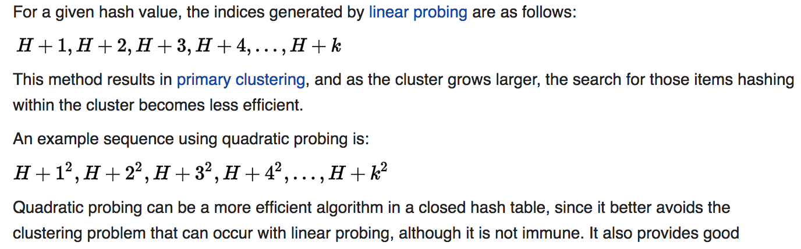
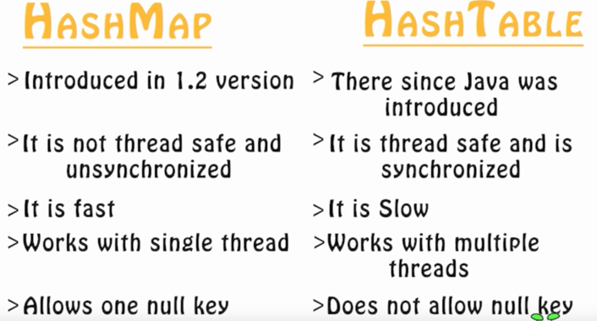

# Hashing, HashMaps, HashTables, Dictionaries and Sets Explored

Note: Java ones are less relevant because most of my interviews will be in python.

## Hash Function

Takes a string, converts it to some sort of integer and maps it into an index into an array.

We need to re-map the hash function output into the array as the range of the hash function might be 3 billion but we don't want the hash table to become that sparse.

> hash function is a function that takes a key from some specific domain and maps it onto some finite set of integer values, called the key’s hash value

> Hashtables are designed to provide average case O(1) time lookup, insertion and deletion for a trade-off of a large amount of memory.

### Good hash function

Typically
- take into account whole key
- unique
- assign characters in a string to a number so we can hash it
- big primes are a good start

TODO: Read up on this part.

#### Rolling Hash

A rolling hash (also known as recursive hashing or rolling checksum) is a hash function where the input is hashed in a window that moves through the input.

Hash as you go kinda thing?

> In a nutshell, a rolling hash is to a normal hash as a moving average is to a simple average, i.e. it's calculated on items within a "window" that moves across the full range of your data. Rolling hash functions are generally designed such that, when you move the data "window", calculating the new hash does not involve a complete recalculation across the entire "window".

TOOD: Read up on this part.

## Handling Collisions

Note: You need to store keys along with values in hashtables as you need to be able to deal with two keys mapping to the same index resulting in a collision, if you don't have the value you can't tell which is the right mapping.

### Chaining

If collision occur, store in a linked list

### Open Addressing

Includes:
- Linear Probing: Linear scan for next avaliable spot, need to modulo length of hashtable for wrap around.
- Quadratic Probing: Instead of linear probing add quadratic polynomial or x^2
- Double Hashing: Like linear probing but instead of a constant step we use a second independent hash function to figure out where to look.

**Linear probing vs Quadratic probing**

You can see quadratic probing makes it more spread out.

### Pseudo-Random Probing

Python does this!

Idea: The ideal probe function would select the next position on the probe sequence at random from among the unvisited slots; that is, the probe sequence should be a random permutation of the hash table positions

Some sources:
- http://www.ida.liu.se/opendsa/OpenDSA/Books/TDDD86_2014/html/HashCImproved.html#

## Different Constructs: HashSet, HashTable, HashMap, Set, Dictionary.

### HashSet

Is a set where you just want to store unique values.

> **The HashSet is an implementation of a Set (interface).** Set is the general interface to a set-like collection, while HashSet is a specific implementation of the Set interface (which uses hash codes, hence the name). Set is a parent interface of all set classes like TreeSet, LinkedHashSet etc

### HashMap vs HashTable (super Java-y)

Both
- for key, value pairs.

HashMap
- can have a single null key and elements.
- faster and less memory as not synchronized but also not threadsafe
- works on a single thread

HashTable
- synchronized meaning it is thread safe, no two threads can work on it at the same time, also means it is slower.

> Synchronized is a Java keyword. It means that the method cannot be executed by two threads at the same time and the JVM take care of enforcing that. In C++, you will have to use some synchronization construct, like a critical section or a mutex.
> When one thread is executing a synchronized method for an object, all other threads that invoke synchronized methods for the same object block (suspend execution) until the first thread is done with the object.

### HashTable (python relevant)

When load factor >= 0.7 it is filling up, double size of table and rehash.

- doesn't allow null keys.
- python dictionaries and sets are implemented on a hashtable.
- key, value pair look up data structure

> Indeed, CPython's sets are implemented as something like dictionaries with dummy values (the keys being the members of the set), with some optimization(s) that exploit this lack of values

> So basically a set uses a hashtable as its underlying data structure. This explains the O(1) membership checking, since looking up an item in a hashtable is an O(1) operation, on average.

> Hash tables are important data structures; Python uses them to implement two important built-in data types, dict and set . A Python dictionary is internally implemented with a hashtable.

> A dictionary is a general concept that maps keys to values. There are many ways to implement such a mapping. A hashtable is a specific way to implement a dictionary. Besides hashtables, another common way to implement dictionaries is red-black trees. Each method has it's own pros and cons. A red-black tree can always perform a lookup in O(log N). A hashtable can perform a lookup in O(1) time although that can degrade to O(N) depending on the input.

## How Python handles collisions

[Amazing source](https://stackoverflow.com/questions/21595048/how-python-dict-stores-key-value-when-collision-occurs)
- Python dictionaries are implemented as hash tables. Hash tables consist of slots, and keys are mapped to the slots via a hashing function.
- Hash table implementations must allow for hash collisions i.e. even if two keys have same hash value, the implementation of the table must have a strategy to insert and retrieve the key and value pairs unambiguously.
- Python dict uses open addressing to resolve hash collisions (uses probing)
- A hash table is a contiguous block of memory, in each slot in the hash table can store one and only one entry. This is important.
- TLDR: Check if exact match, if so don't do anything. If the slot is occupied, CPython (and even PyPy) compares the hash and the key (by compare I mean == comparison not the is comparison) of the entry in the slot against the key of the current entry to be inserted (dictobject.c337,344-345). If both match, then it thinks the entry already exists, gives up and moves on to the next entry to be inserted. If either hash or the key don't match, it starts probing.
- TLDR: Uses random probing. Probing just means it searches the slots by slot to find an empty slot. Technically we could just go one by one, i+1, i+2, ... and use the first available one (that's linear probing). But for reasons explained beautifully in the comments (see dictobject.c:33-126), CPython uses random probing. In random probing, the next slot is picked in a pseudo random order. The entry is added to the first empty slot. For this discussion, the actual algorithm used to pick the next slot is not really important (see dictobject.c:33-126 for the algorithm for probing). What is important is that the slots are probed until first empty slot is found.
- This is the same for lookups