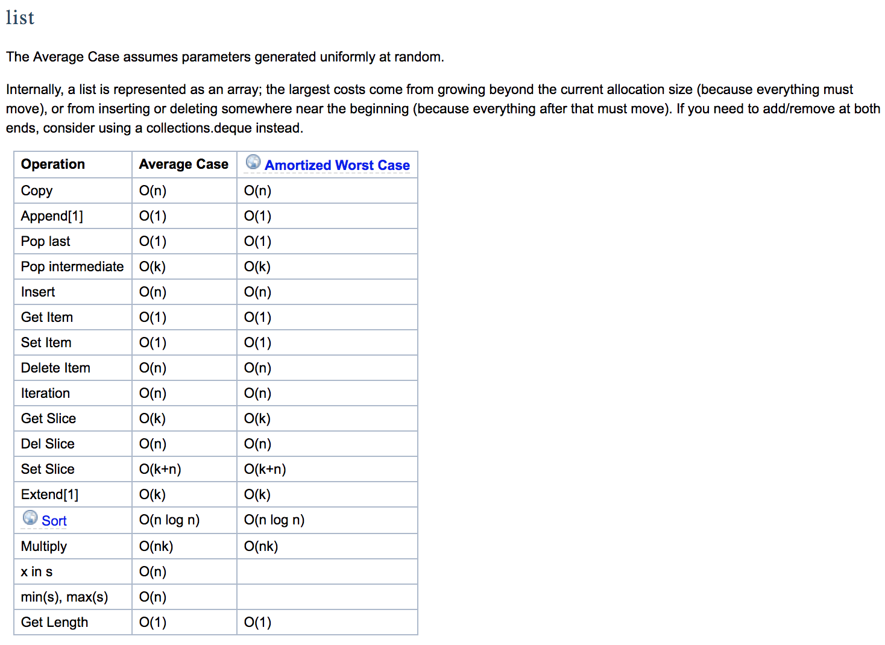
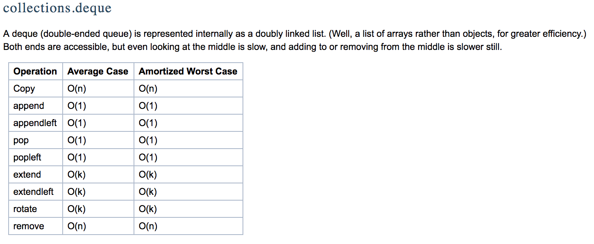
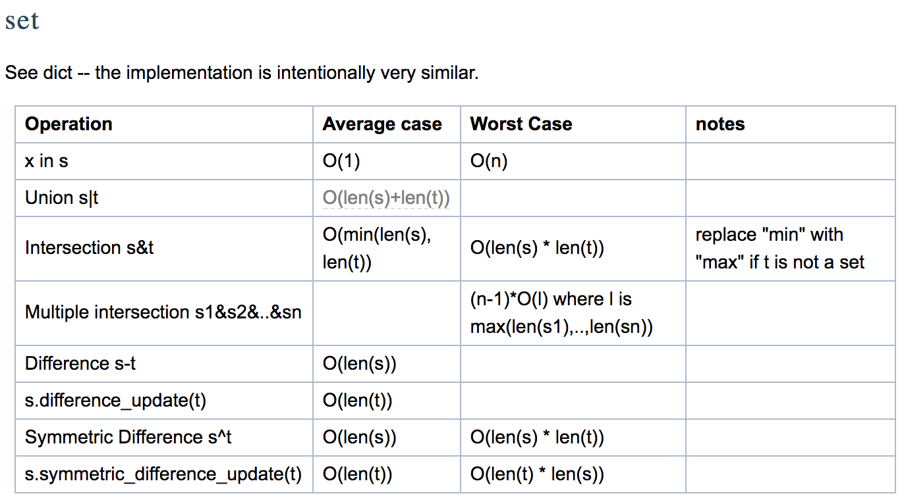
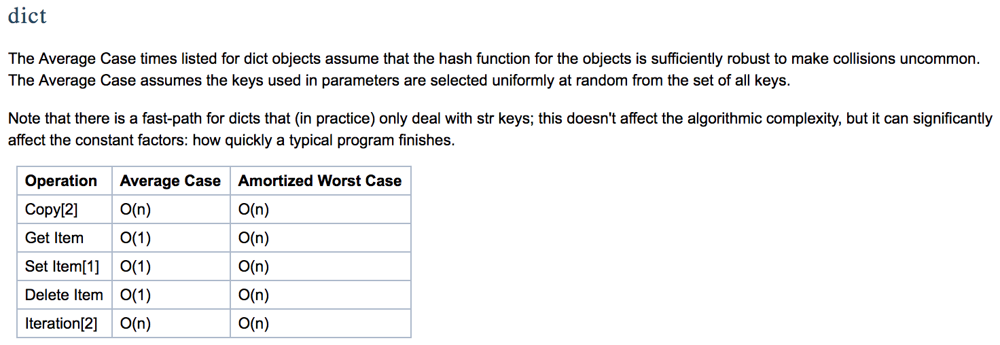

# Under the snake (python internals)

source: https://wiki.python.org/moin/TimeComplexity

## List

Important
- represented as an array
- big cost in growing beyond allocation size
- big cost in inserting near the begging as need to shift elements right

Gotchas
- slicing is O(k) and exclusive on the right bound
- `min()`, `max()` is O(n)



## Deque

Important
- list like with fast `append()` and `pop()` from both sides (`append()`, `appendleft()`, `pop()`, `popleft()`)
- can also extend on both sides
- can use to implement a circular queue easily where adding an item out of bounds removes the first item
- can rotate to the left/right



```python
from collections import deque

length_of_queue = 5
circular_queue = deque(maxlen=length_of_queue)

for i in range(10):
    circular_queue.append(i)
print(circular_queue)  # deque([5, 6, 7, 8, 9], maxlen=5)

drinks = ["water", "coffee", "v", "milk", "potato"]
d = deque(drinks)
print(d)      # deque(['water', 'coffee', 'v', 'milk', 'potato'])
d.rotate(2)   # rotate array elements 2 to the right.
print(d)      # deque(['milk', 'potato', 'water', 'coffee', 'v'])
d.rotate(-4)  # rotate array elements 4 to the left.
print(d)      # deque(['v', 'milk', 'potato', 'water', 'coffee'])

# reverse deque, need to make a new deque/loop over it as it returns an iterator
print(deque(reversed(d)))  # deque(['coffee', 'water', 'potato', 'milk', 'v'])

# iteration.
for i in reversed(d):
    print(i)

d.clear()    # Empty everything.
print(d)     # deque([])
```
## Set

Important
- like dicts with similar implementation
- O(n) worst case look up
- order not maintained



```python
list = [1, 2, 3, 4, 5, 6, 7, 7, 7, 8]
my_set = set(list)
your_set = set([1, 2, 100, 8, 7])
their_set = {7, 8, 9, 199}

print("my set: %s" % my_set)
print("your set: %s" % your_set)
print("their set: %s" % their_set)

# Unique values between sets.
difference = my_set - your_set  # {3, 4, 5, 6, 7, 8}
print("unique values (difference) in my set but not in your set: %s" % difference)

# Intersection between sets.
intersection = my_set & your_set
print("intersection between my set and your set: %s" % intersection)  # {1, 2}

# Union of two sets
union = my_set | your_set
print("union between my set and your set: %s" % union)  # {1, 2, 3, 4, 5, 6, 7, 8, 100}

# Values in set a or set b but not in both.
appears_once_in_both = my_set ^ your_set
print("appears in either my set or your set but not both: %s" % appears_once_in_both)  # {3, 100, 4, 5, 6}

# Comprehension.
big_list_of_things = ["apple", "pear", "banana", "table", "mouth", "mouse", "hair"]
things_that_are_not_fruit = {"table", "mouth", "mouse", "hair"}
fruit = {thing for thing in big_list_of_things if thing not in things_that_are_not_fruit}
print("fruit: %s" % fruit)

# Iteration over set.
for f in fruit:
    print(f)
```

## Dictionary

Important
- average case times listed for dict objects assume that the hash function for the objects is sufficiently robust to make collisions uncommon.
- get, set, delete all O(n) worst case.
- order not maintained



```python
# Building dict.
dummy_dict = {}
dummy_dict['a'] = 'Apple'
dummy_dict['b'] = 'Batman'
dummy_dict['c'] = 'Candy'
dummy_dict['e'] = 'Egg Yolk'
dummy_dict['f'] = 'Frogs'
dummy_dict['g'] = 'Gnome'

key_value_pairs = [('burger', 10), ('chips', 100), ('greens', 2)]
yum = dict(key_value_pairs)
print(yum.items())
print(yum['burger'])

# Iteration.
for key in dummy_dict:
    print(str("key: " + str(key) + ", value: " + str(dummy_dict[key])))
for key, value in dummy_dict.items():
    print("key: %s, value: %s" % (key, value))

# Getting stuff.
print(dummy_dict.get('a'))
print(dummy_dict['a'])

# Deleting stuff.
del dummy_dict['a']
dummy_dict.pop('b')    # dictionary.pop(key, default)
print(dummy_dict.items())

# Keys can be anything that it not mutable (integers, keys, tuples).

# Comprehension, mapping of n: n ** 2.
squared_even_numbers = {n: n ** 2 for n in range(2, 100, 2)}
print(squared_even_numbers.keys())
print(squared_even_numbers.values())
```

## Dict Implementation Notes

> It's basically a hash table with a bunch of optimizations for special cases. In particular, it will need to resize itself whenever certain thresholds are exceeded, which could be a slow operation.

> Python’s dictionaries are implemented as resizable hash tables. Compared to B-trees, this gives better performance for lookup (the most common operation by far) under most circumstances, and the implementation is simpler.

> Dictionaries work by computing a hash code for each key stored in the dictionary using the hash() built-in function. The hash code varies widely depending on the key; for example, “Python” hashes to -539294296 while “python”, a string that differs by a single bit, hashes to 1142331976. The hash code is then used to calculate a location in an internal array where the value will be stored. Assuming that you’re storing keys that all have different hash values, this means that dictionaries take constant time – O(1), in computer science notation – to retrieve a key. It also means that no sorted order of the keys is maintained, and traversing the array as the .keys() and .items() do will output the dictionary’s content in some arbitrary jumbled order.